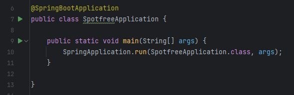

# Spotfree



### Ajustes e melhorias

O projeto ainda está em desenvolvimento e as próximas atualizações serão voltadas nas seguintes tarefas:

- [X] Implementação H2
- [x] Autenticação
- [X] Autorização
- [ ] Fluxo de troca de Senha
- [ ] Desenvolvimento do Front
- [ ] Script de inicialização do projeto

## 💻 Pré-requisitos

Antes de começar, verifique se você atendeu aos seguintes requisitos:
* Você instalou `Java 17`
* Você instalou `Maven 3.8`

## 🚀 Instalando Spotfree

Para instalar o Spotfree, siga estas etapas:

```
mvn wrapper:wrapper
```

```
./mvnw clean install
```

## ☕ Usando Spotfree

Para usar Spotfree, siga estas etapas:

```
./mvnw clean install
```
```
./mvnw spring-boot:run
```


## 🤝 Colaboradores

<table>
  <tr>
    <td align="center">
      <a href="#">
        <br>
        <sub>
          <b>Antonio Junior</b>
        </sub>
      </a>
    </td>
  </tr>
</table>